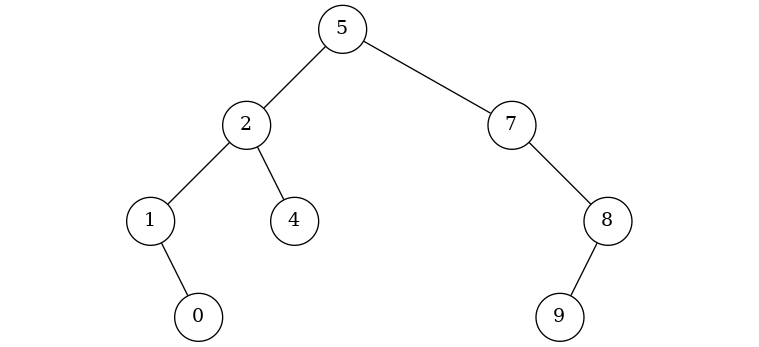
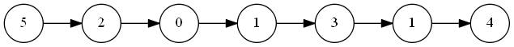

# Binary Tree and Linked List Visualizer

A tool to visualize binary trees and linked lists based on GraphViz.

## Requirements

- GraphViz

    Download: http://www.graphviz.org/download/

    **Note:** GraphViz must be added into `PATH` environment variable.

## Usage

#### Binary Tree

- Definition of TreeNode
    ```C++
    // This is the same definition in Leetcode.
    struct TreeNode
    {
        int val;
        TreeNode *left;
        TreeNode *right;
        TreeNode(int x) : val(x), left(NULL), right(NULL) {}
    };
    ```

- Build a binary tree

    In order to build the following binary tree:
    >           5
    >          / \
    >         2   7
    >        / \   \
    >       1   4   8

    We may call function `makeTree` like this:
    ```C++
    TreeNode *root = makeTree({ 5,2,7,1,4,null,8 });
    ```

    **Note:** `null` represents an empty node. This is compatible with leetcode.

- Visualize the binary tree

    Call function `showTree` like this:
    ```C++
    showTree(root);
    ```

    The result is shown below:

    

- Delete the binary tree
    ```C++
    delTree(root);
    root = nullptr;
    ```

#### Linked List

- Definition of ListNode
    ```C++
    // This is the same definition in Leetcode.
    struct ListNode
    {
        int val;
        ListNode *next;
        ListNode(int x) : val(x), next(NULL) {}
    };
    ```

- Build a linked list

    In order to build the following linked list:
    ```flow
    5=>start: 5
    2=>start: 2
    0=>start: 0
    1_1=>start: 1
    3=>start: 3
    1_2=>start: 1
    4=>end: 4
    5(right)->2(right)->0(right)->1_1(right)->3(right)->1_2(right)->4
    ```

    We may call function `makeTree` like this:
    ```C++
    ListNode *head = makeList({ 5,2,0,1,3,1,4 });
    ```

- Visualize the linked list

    Call function `showList` like this:
    ```C++
    showList(head);
    ```

    The result is shown below:

    

- Delete the linked list
    ```C++
    delList(head);
    head = nullptr;
    ```