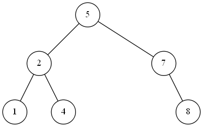

# binarytree-visualizer

A tool to visualize binary trees based on GraphViz.

## Requirements

- GraphViz
    Download: http://www.graphviz.org/download/

    **Note:** GraphViz must be added into `PATH` environment variable.

## Usage

- Definition of TreeNode
    ```C++
    // This is the same definition in Leetcode.
    struct TreeNode
    {
        int val;
        TreeNode *left;
        TreeNode *right;
        TreeNode(int x) : val(x), left(NULL), right(NULL) {}
    };
    ```

- Build a binary tree
    In order to build the following binary tree:
    >           5
    >          / \
    >         2   7
    >        / \   \
    >       1   4   8
    We may call function `makeTree` like this:
    ```C++
    TreeNode *root = makeTree({ 5,2,7,1,4,null,8 });
    ```
    **Note:** `null` represents an empty node. This is compatible with leetcode.

- Visualize the binary tree
    Call function `showTree` like this:
    ```C++
    showTree(root);
    ```
    The result is shown below:

    
